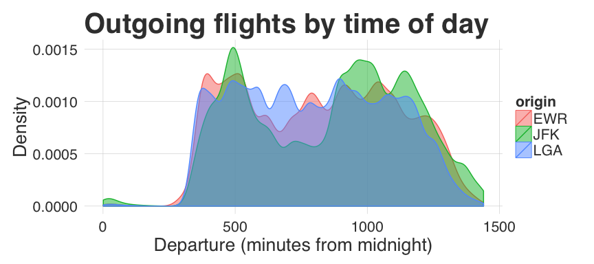

# Clarity (ggplot2 theme)

A sane ggplot2 theme with large text and clean lines, suitable for presentations. Based off the fivethirtyeight theme from [ggthemes](https://github.com/jrnold/ggthemes).

Install using `devtools::install_github("eclarke/eclthemes")`.


```r
library(ggplot2)
library(eclthemes)
library(nycflights13)

flights <- within(flights, {
  dep_time_min <- hour*60 + minute
})

ggplot(flights, aes(dep_time_min, color=origin, group=origin, fill=origin)) +
  geom_density(alpha=0.5) +
  theme_clarity() +
  ylab("Density") +
  xlab("Departure (minutes from midnight)") +
  ggtitle("Outgoing flights by time of day")
```

 

