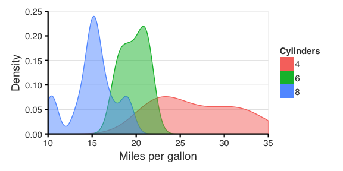

# Clarity (ggplot2 theme)

A sane ggplot2 theme with large text and clean lines, suitable for presentations. Based off the fivethirtyeight theme from [ggthemes](https://github.com/jrnold/ggthemes).

Install using `devtools::install_github("eclarke/eclthemes")`.


```r
library(ggplot2)
library(eclthemes)
library(nycflights13)

flights <- within(flights, {
  dep_time_min <- hour*60 + minute
})

ggplot(flights, aes(dep_time_min, color=origin, group=origin, fill=origin)) +
  geom_density(alpha=0.5) +
  theme_clarity() +
  ylab("Density") +
  xlab("Departure (minutes from midnight)") +
  ggtitle("Outgoing flights by time of day")
```

 

To add axis lines:


```r
theme_clarity2 <- theme_clarity() +
  theme(
    axis.line = element_line(size=0.8),
    strip.background = element_blank(),
    strip.text = element_text(hjust=0.5)
  )

ggplot(mtcars, aes(mpg, color=factor(cyl), fill=factor(cyl), group=factor(cyl))) + 
  geom_density(alpha=0.5) + 
  theme_clarity() +
  theme(
    axis.line = element_line(size=0.8),
    strip.background = element_blank(),
    strip.text = element_text(hjust=0.5)
  )
```

 

